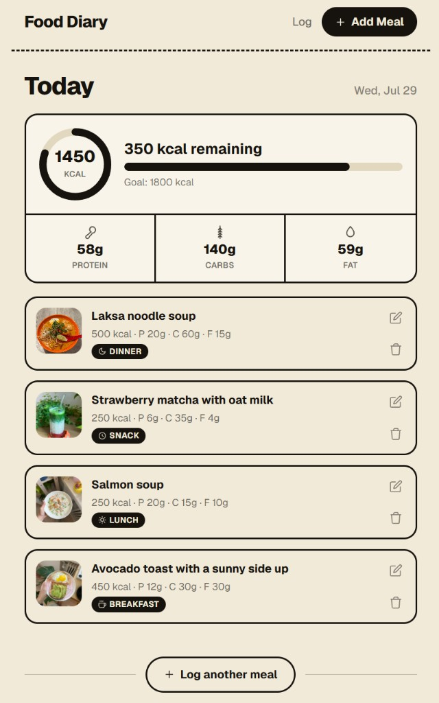
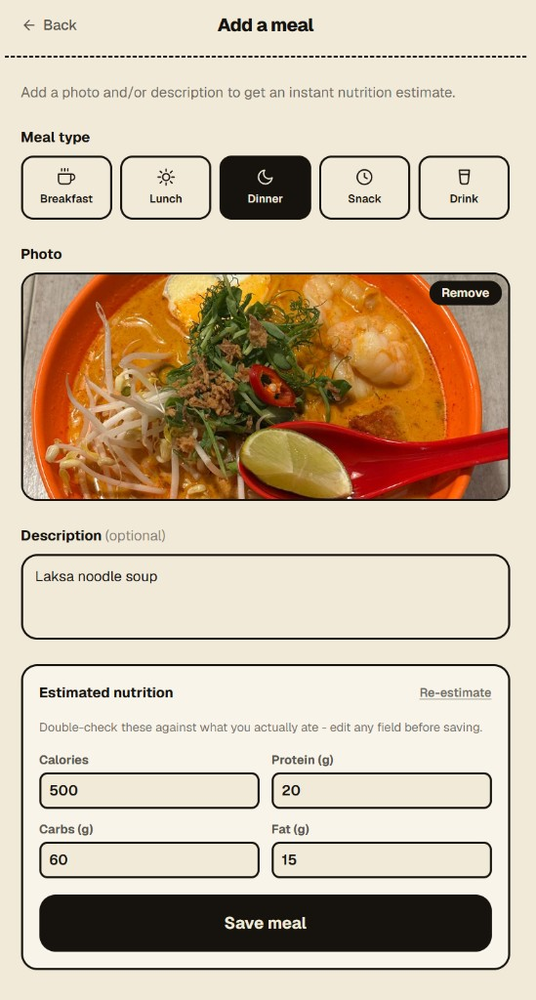

# Food Diary

A local-first food diary. Log a meal by photo and/or short description and get an instant
calorie/protein/carb/fat estimate from a vision-language model.

No auth, single user: this is a personal project, not a multi-tenant product. Develop against a
local Ollama model, then switch to Hugging Face Inference Providers for deployment (see
[Switching nutrition providers](#switching-nutrition-providers-eg-for-deployment) below).

## Screenshots

| Log | Add a meal |
| --- | --- |
|  |  |

## Stack

- **Frontend:** Next.js (App Router) + TypeScript + Tailwind CSS
- **Backend/storage:** Supabase (Postgres + Storage), run locally via the Supabase CLI + Docker
- **Nutrition estimation:** a local Ollama vision-language model by default, called through a
  single `estimateNutrition()` seam (see [lib/nutrition](lib/nutrition)) so it can be swapped for
  a hosted inference API - a Hugging Face provider is already included - with no other code
  changes. Ollama can't run inside a Vercel deployment (no persistent server, multi-GB model
  weights), so switch to `NUTRITION_PROVIDER=huggingface` before deploying.

## Prerequisites

- [Node.js](https://nodejs.org/) 18.18+
- [Docker Desktop](https://www.docker.com/products/docker-desktop/) (for the local Supabase stack)
- [Ollama](https://ollama.com/download) with at least one vision-capable model pulled, e.g.:

  ```bash
  ollama pull gemma3:4b
  # or: ollama pull llava
  ```

## Setup

1. Install dependencies:

   ```bash
   npm install
   ```

2. Start the local Supabase stack (Postgres + Storage), which also applies the migrations in
   [supabase/migrations](supabase/migrations) (creates the `meals` table and the private
   `meal-photos` Storage bucket):

   ```bash
   npx supabase start
   ```

   This prints an `API_URL`, `ANON_KEY`, and `SERVICE_ROLE_KEY`. You can also get these anytime via
   `npx supabase status`.

3. Copy the example env file and fill in your local Supabase URL/keys and Ollama model:

   ```bash
   cp .env.local.example .env.local
   ```

   - `NEXT_PUBLIC_SUPABASE_URL` -> the `API_URL` from step 2 (typically `http://127.0.0.1:54321`)
   - `SUPABASE_SECRET_KEY` -> the `SECRET_KEY` from step 2 (`sb_secret_...`, server-only, never
     exposed to the browser - this is the new key that replaces the legacy `service_role` JWT,
     which Supabase is sunsetting)
   - `OLLAMA_MODEL` -> whichever vision-capable model you've pulled (check with `ollama list`)

4. Make sure Ollama is running (`ollama serve`, or just have the desktop app open) and start the
   dev server:

   ```bash
   npm run dev
   ```

5. Open [http://localhost:3000](http://localhost:3000). Use "Add Meal" to log something, then
   check the Log view for the entry and the day's running totals.

## Switching nutrition providers (e.g. for deployment)

Ollama needs a persistent local process and multi-GB model weights, so it can't run inside a
serverless deployment like Vercel. For local development, keep `NUTRITION_PROVIDER=ollama`. Before
deploying (or any time you want a hosted model instead), switch to Hugging Face:

1. Create a fine-grained token at [huggingface.co/settings/tokens](https://huggingface.co/settings/tokens)
   with "Make calls to Inference Providers" permission (this API has a free tier).
2. Set in your env (`.env.local` locally, or your deployment's environment variables):
   ```bash
   NUTRITION_PROVIDER=huggingface
   HUGGINGFACE_API_KEY=hf_...
   # Optional. Default is Qwen/Qwen2.5-VL-72B-Instruct — a checkpoint that is
   # actually routable via Inference Providers on a typical HF account.
   # Smaller VLMs (e.g. Qwen2.5-VL-3B-Instruct) often aren't; confirm on
   # https://huggingface.co/settings/inference-providers before changing this.
   HUGGINGFACE_MODEL=Qwen/Qwen2.5-VL-72B-Instruct
   ```

No other code changes are needed - `lib/nutrition/estimateNutrition.ts` picks the provider based
on `NUTRITION_PROVIDER` alone. Both providers call Hugging Face / Ollama through the same
`NutritionProvider` interface in `lib/nutrition/types.ts`. The Hugging Face fallback model is
exported as `DEFAULT_HUGGINGFACE_MODEL` from `huggingfaceProvider.ts` (tests assert this stays
routable). To add another backend (OpenAI, Anthropic, etc.), copy the pattern in
`lib/nutrition/providers/huggingfaceProvider.ts` and register it in `getProvider()`.

### Provider constraints

| Concern | Ollama | Hugging Face |
| --- | --- | --- |
| Where it runs | Local process (`OLLAMA_BASE_URL`, default `http://localhost:11434`) | Hosted OpenAI-compatible API at `https://router.huggingface.co/v1` |
| Model env | `OLLAMA_MODEL` (default `llava`) — must be vision-capable and already pulled | `HUGGINGFACE_MODEL` (default `Qwen/Qwen2.5-VL-72B-Instruct`) — must be routable on your account |
| Auth | None | `HUGGINGFACE_API_KEY` required |
| Photos | Fetched server-side and sent as base64 | Fetched server-side and inlined as a data URL (HF can't reach private/local signed URLs) |
| Timeout | `ESTIMATE_TIMEOUT_MS` (code default 30s; `.env.local.example` uses 60s for cold local models) | Same env var |

## Deployment (Vercel)

There is currently **no advertised live URL** — production sharing is paused. The repo can still
be deployed to Vercel (git-connected projects auto-deploy on push to `main`). To stand up your
own deployment:

1. Create a hosted Supabase project (`npx supabase projects create`, or via the dashboard) and
   push the migrations: `npx supabase link --project-ref <ref>` then `npx supabase db push`.
2. Import this repo in [Vercel](https://vercel.com/new) (or `vercel link` + `vercel git connect`).
3. Set these environment variables in the Vercel project (Production and Preview) - see
   [Setup](#setup) and [Switching nutrition providers](#switching-nutrition-providers-eg-for-deployment)
   above for where each value comes from:
   - `NEXT_PUBLIC_SUPABASE_URL`, `SUPABASE_SECRET_KEY` - from the hosted Supabase project
   - `NUTRITION_PROVIDER=huggingface`, `HUGGINGFACE_API_KEY`, `HUGGINGFACE_MODEL` - Ollama can't
     run on Vercel (no persistent server, multi-GB model weights)
   - `ESTIMATE_TIMEOUT_MS` (e.g. `60000`) - optional, Vercel's Fluid Compute default (300s) is
     comfortably above this either way
4. Deploy (`vercel --prod`, or just push to `main`).

Since this repo is public, double check before deploying: no `.env*` file except
`.env.local.example` is tracked (see `.gitignore`), and all real secrets live only in Vercel's
encrypted environment variables / your local `.env.local` - never in git history.

## Testing

Vitest covers the high-risk server paths (no browser/E2E suite yet):

```bash
npm test          # single run (CI-friendly)
npm run test:watch
```

| Area | Files | What it locks in |
| --- | --- | --- |
| Provider routing | `lib/nutrition/estimateNutrition.test.ts` | Default `ollama`, `NUTRITION_PROVIDER=huggingface`, unknown provider rejection |
| Hugging Face provider | `lib/nutrition/providers/huggingfaceProvider.test.ts` | `DEFAULT_HUGGINGFACE_MODEL` (`Qwen/Qwen2.5-VL-72B-Instruct`), env override, auth/timeout/parse errors, image inlining |
| Estimate API | `app/api/estimate/route.test.ts` | JSON body + error → HTTP status mapping |
| Create meal API | `app/api/meals/route.test.ts` | Macro / mealType / photo-or-description validation |
| Log grouping | `lib/meals/grouping.test.ts`, `lib/meals/types.test.ts` | Day buckets, totals, date/time labels, `isMealType` |

Config: `vitest.config.ts` (Node environment, `**/*.test.ts`, `@/` alias). Tests mock providers and
Supabase; they do not require Ollama or a running database.

## Meal logging workflow

Adding a meal on `/add` runs this client → API chain (see `components/MealForm.tsx`):

1. **Upload (optional)** — `POST /api/upload` with multipart field `photo` (max 10MB). Stores the
   file in the private `meal-photos` bucket and returns `{ path, url }` where `url` is a
   short-lived signed URL (~1 hour). Oversized files return HTTP 413.
2. **Estimate** — `POST /api/estimate` with `{ photoUrl?, description? }` (at least one required).
   Routes through `estimateNutrition()` → the active provider. Success body:
   `{ calories, protein, carbs, fat }`. Error mapping (`lib/nutrition/errors.ts`):
   `NutritionInputError` / `NutritionParseError` → 422, `NutritionUnavailableError` → 503,
   `NutritionTimeoutError` → 504, unknown → 500.
3. **Save** — `POST /api/meals` with the estimate plus optional `photoPath`, `description`, and
   `mealType` (`breakfast` \| `lunch` \| `dinner` \| `snack` \| `drink`). Requires at least a
   photo path or non-empty description, a valid `mealType` when present, and finite numbers for
   all four macros. Persists via `lib/meals/repository.ts` (201 on success).

**Re-estimate / retry:** After a successful upload, `MealForm` keeps both the Storage `path` and
the signed `url` in component state. A second estimate (error retry or the "Re-estimate" button)
reuses that signed URL and does **not** re-upload. Clearing or replacing the photo resets both.
If the signed URL has expired (~1 hour), upload again before estimating. Manual entry
("skip estimate") jumps to the review stage with zeros so macros can be typed in by hand.

Other meal APIs: `GET /api/meals` (list, newest first), `PATCH /api/meals/[id]` (rename
description; empty name → 400), `DELETE /api/meals/[id]` (row + photo cleanup; unknown id → 404).

The Log view (`/`) groups meals by local calendar day via `lib/meals/grouping.ts`
(`groupMealsByDay`) and shows progress against a fixed `DAILY_CALORIE_GOAL` of 1800 kcal
(not yet a user setting).

## Project structure

- `app/` - routes: `/` (Log view), `/add` (meal entry form), `/api/estimate`, `/api/upload`,
  `/api/meals`, `/api/meals/[id]`
- `lib/nutrition/` - the `estimateNutrition()` seam and its providers (Ollama, Hugging Face) -
  swap between them via the `NUTRITION_PROVIDER` env var
- `lib/meals/` - Supabase data access (repository) and day-grouping/formatting helpers
  (`DAILY_CALORIE_GOAL`, `groupMealsByDay`, date/time formatters)
- `lib/supabase/server.ts` - server-only Supabase client (secret key)
- `supabase/migrations/` - the `meals` table and `meal-photos` Storage bucket, both with RLS
  enabled and no anon/authenticated policies (access only via the secret key, server-side)
- `*.test.ts` + `vitest.config.ts` - unit/API regression tests (see [Testing](#testing))

## Notes on data access

The `meals` table and `meal-photos` bucket have row-level security enabled with no policies for
`anon`/`authenticated`, so the browser never talks to Supabase directly - every read/write goes
through a Next.js API route using the secret key. When multi-user auth is added later, this
table can grow user-scoped RLS policies without changing today's server-side access pattern.

`photo_url` in Postgres stores the **Storage object path**, not a public URL. Signed URLs are
minted on read (`listMeals` / upload response) and expire after about an hour.

## Troubleshooting

| Symptom | Likely cause | Fix |
| --- | --- | --- |
| Estimate returns 503 / "local model server is unavailable" | Ollama isn't running, or wrong `OLLAMA_BASE_URL` | Start Ollama (`ollama serve` / desktop app); confirm `ollama list` shows your model |
| Estimate times out (504) | Cold start or slow CPU inference | Raise `ESTIMATE_TIMEOUT_MS` (e.g. `60000`); first Ollama request after idle is often slow |
| HF estimate fails with HTTP 4xx mentioning the model | Model not routable via Inference Providers | Use the default `Qwen/Qwen2.5-VL-72B-Instruct`, or pick a VLM listed under [Inference Providers](https://huggingface.co/settings/inference-providers) for your account — smaller checkpoints often aren't available |
| HF estimate: missing API key | `HUGGINGFACE_API_KEY` unset while `NUTRITION_PROVIDER=huggingface` | Create a fine-grained token with "Make calls to Inference Providers" and set it in env |
| Supabase client errors on boot / upload | Missing or wrong `NEXT_PUBLIC_SUPABASE_URL` / `SUPABASE_SECRET_KEY` | Run `npx supabase status` and copy `API_URL` + `SECRET_KEY` (`sb_secret_...`) into `.env.local` |
| Photo preview works but estimate can't load the image | Signed URL expired or Storage unreachable from the server | Clear the photo and upload again (retry alone can't mint a fresh signed URL); ensure the Next.js server can reach local Supabase (`127.0.0.1:54321`) |
| Re-estimate after an error ignores the photo | Client bug (pre-fix) or expired URL | Current `MealForm` caches `uploadedUrl` with `uploadedPath`; if still wrong, hard-refresh and re-upload |

## Useful commands

```bash
npm test               # run unit/API regression tests
npx supabase status    # print local API URL / keys again
npx supabase stop      # stop the local stack
npx supabase db reset  # recreate the local DB and reapply migrations
ollama list            # see which local models are available
```
